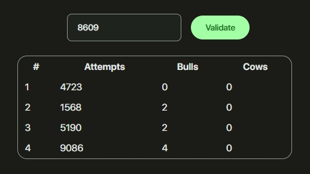

# Bulls and Cows

A simple, web-based implementation of the classic code-breaking game "Picas y Fijas", also known as "Bulls and Cows". This project is built with plain HTML, CSS, and Vanilla JavaScript, and styled with Material Design 3 components.

## How to Play

The objective is to guess a secret 4-digit number with unique digits generated by the computer. You have a maximum of 10 attempts.

1.  The game starts automatically, and a secret 4-digit number is generated.
2.  Enter your 4-digit guess into the input field. The digits must be unique.
3.  Click the **"Validar"** (Validate) button to submit your guess.
4.  Your attempt will be added to the table with feedback:
    *   **Picas (Cows):** The number of correct digits that are in the wrong position.
    *   **Fijas (Bulls):** The number of correct digits in the correct position.
5.  Use this feedback to refine your next guess.
6.  The game ends when you either guess the number correctly (4 Fijas) or run out of your 10 attempts. A dialog will appear announcing the result.

## Features

-   **Interactive Gameplay:** Classic Bulls and Cows logic implemented in JavaScript.
-   **Attempt History:** A table displays a history of your guesses and the corresponding Picas and Fijas.
-   **Input Validation:** Ensures that guesses are 4 digits long and contain no repeating digits.
-   **Modern UI:** Clean user interface styled with [Material Design 3](https://github.com/dejesusbg/md3) components.
-   **No Dependencies:** Runs directly in any modern web browser without needing a build step or server.

## Running Locally

To run this game on your local machine, follow these simple steps:

1.  Clone the repository:
    ```sh
    git clone https://github.com/dejesusbg/bulls-and-cows.git
    ```
2.  Navigate into the project directory:
    ```sh
    cd bulls-and-cows
    ```
3.  Open the `index.html` file in your preferred web browser.

That's it! The game is ready to play.

## Screenshot


